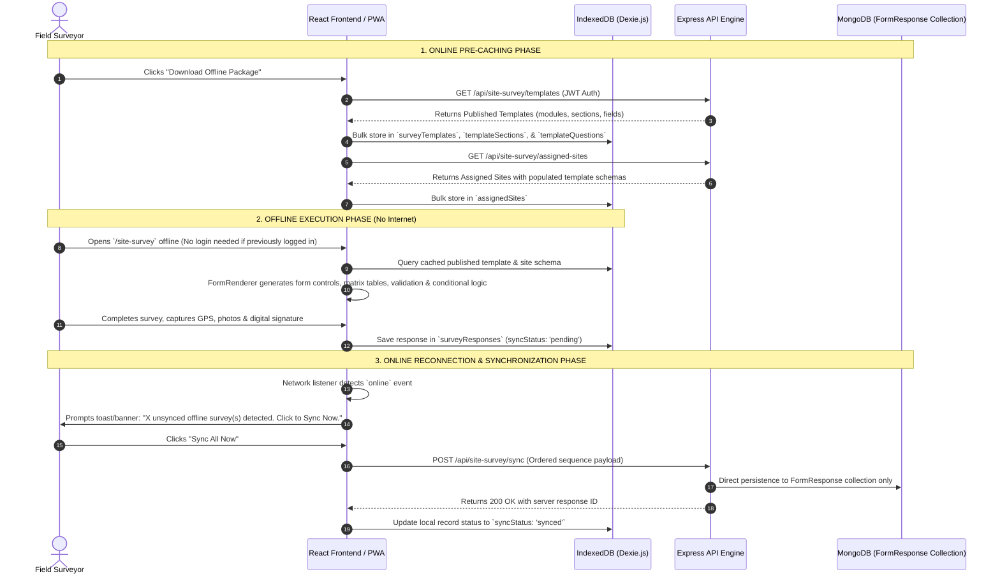

# FRONTEND - Offline Site Survey Module with Template Library

An offline-capable Progressive Web Application (PWA) module integrated into the existing MERN web application. The module is **100% template-driven**, enabling field surveyors to pre-cache published survey templates and assigned sites, collect data completely offline (including GPS, photos, attachments, digital signatures, and ratings), and synchronize data back to the server in a strict sequential order upon network reconnection.

---

## 1. System Architecture & Data Flow



---

## 2. Core Concepts

### A. Template Library & Form Builder Integration
- Survey forms are **never hardcoded**. Forms are dynamically rendered from published JSON templates created by administrators in the Template Library / Form Builder.
- **Unified Layout Parity**: The offline rendering engine uses the exact same `FormRenderer` ([FormRenderer.tsx](file:///e:/DRM/PDRM/FRONTEND/src/components/TemplateEngine/FormRenderer/FormRenderer.tsx)) as online surveys (`/responses/:templateId`). This guarantees 100% design, input, step module, and field component parity between online and offline modes.

### B. Client-Side Database (Dexie.js IndexedDB)
- Utilizes Dexie.js ([db.ts](file:///e:/DRM/PDRM/FRONTEND/src/offline/db.ts)) with 10 structured local collections:
  - `assignedSites`: Assigned site metadata, locations, and priority.
  - `surveyTemplates`: Cached published templates (`modules`, `sections`, `questions`).
  - `templateSections`: Section order and metadata.
  - `templateQuestions`: Question schemas, options, validation rules, and conditional logic.
  - `lookupValues`: Cached dropdown reference codes.
  - `surveyResponses`: Offline draft & completed survey responses (`syncStatus: 'pending' | 'synced'`).
  - `surveyPhotos`: Base64 photo evidence captured offline.
  - `surveyAttachments`: Uploaded documents.
  - `pendingUploads`: Queue of sync tasks.
  - `syncLogs`: History of synchronization attempts.

### C. 20+ Supported Field Types & Dynamic Logic
- **Field Types**: Text, Textarea, Number, Date, Time, Dropdown, Multi-select, Radio Buttons, Checkboxes, Switch, Boolean, Ratings, Live GPS Geolocation, Camera Photo Evidence, File Attachments, Canvas Digital Signature.
- **Advanced Controls**:
  - `MatrixField`: Multi-column $\times$ multi-row rating and evaluation matrices.
  - `TableField`: Dynamic addable row data tables.
  - `SystemAutoFill`: Automatic population of user name, phone, email, and organization details.
- **Offline Conditional Logic**: Client-side evaluation of field visibility (`equals`, `not_equals`, `contains`, `greater_than`, `less_than`) executed in real-time without server round-trips.

### D. Cached Authentication & Offline Access
- **No Login Required When Offline**: Once a surveyor logs in while online, their session token and user profile are cached in `localStorage` and `AuthContext`.
- When opening `/site-survey` completely offline, `AuthContext` initializes the user's identity automatically. Surveyors can inspect sites and complete forms without re-authenticating.

### E. Automatic Unsynced Offline Survey Notification
- When network connectivity returns (`online` event), an event listener queries IndexedDB for pending survey responses (`db.surveyResponses.where('syncStatus').equals('pending')`).
- If unsynced surveys exist, an interactive toast alert and a visual banner pop up:
  > ⚠️ **Unsynced Offline Surveys Detected**: You have **X** offline survey response(s) stored locally on this device. **[Sync All Now]**

### F. Sequential 7-Step Ordered Sync Engine
- [syncEngine.ts](file:///e:/DRM/PDRM/FRONTEND/src/offline/syncEngine.ts) executes synchronization in a strict 7-step dependency sequence:
  1. **Survey Header**: Prepares local ID, site ID, template ID, and surveyor identity.
  2. **Form Responses**: Transmits dynamic answers map.
  3. **GPS Data**: Transmits latitude, longitude, and accuracy.
  4. **Photos**: Uploads photo evidence.
  5. **Attachments**: Uploads file attachments.
  6. **Digital Signatures**: Uploads base64 signature image.
  7. **Status Update**: Marks survey as `Synced`, updates local IndexedDB, and records sync log.

### G. Direct `FormResponse` MongoDB Collection Persistence
- Upon receiving synchronized payloads at `POST /api/site-survey/sync`, the backend creates documents **directly in the `FormResponse` MongoDB collection** (`FormResponse.create(...)`).
- Synced data does **NOT** mutate or write to secondary assessment collections (`WoredaAssessment` or `HouseholdAssessment`). All synced data is immediately viewable and exportable via Response Explorer (`/admin/responses`).

---

## 3. Directory Map & File References

```
FRONTEND/
├── public/
│   ├── manifest.json                  # PWA Web App Manifest ("FDRMS Survey")
│   └── sw.js                          # Service Worker for app shell caching & dev bypass
├── src/
│   ├── api/
│   │   └── axios.ts                   # Central Axios client with bearer token interceptor
│   ├── components/
│   │   ├── survey/
│   │   │   └── DynamicSurveyForm.tsx # IndexedDB wrapper around FormRenderer
│   │   └── TemplateEngine/
│   │       └── FormRenderer/
│   │           ├── FormRenderer.tsx   # Core step-by-step form renderer
│   │           └── FieldComponents.tsx# 20+ field components (Matrix, Signature, Geo, etc.)
│   ├── offline/
│   │   ├── db.ts                      # Dexie IndexedDB with 10 local tables
│   │   ├── offlineAuth.ts             # Cached session token & user storage
│   │   └── syncEngine.ts              # Sequential 7-step sync engine
│   └── pages/
│       └── survey/
│           └── SiteSurveyModule.tsx   # Dashboard page matching /admin/profile-mapping
```

---

## 4. How to Test the Offline Site Survey Module

1. **Start Applications**:
   - Backend: `npm start` (in `BACKEND` directory, port `5000`)
   - Frontend: `npm run dev` (in `FRONTEND` directory, port `5173`)

2. **Pre-Cache Package (Online)**:
   - Navigate to `http://localhost:5173/site-survey`.
   - Click **"Download Offline Package"**.
   - Verify that assigned sites and published templates are cached into IndexedDB (`DevTools` $\rightarrow$ `Application` $\rightarrow$ `IndexedDB` $\rightarrow$ `SiteSurveyPWA_DB`).

3. **Complete Survey Offline**:
   - Disconnect internet connection (DevTools $\rightarrow$ Network $\rightarrow$ Offline).
   - Select an assigned site and click **"Start Dynamic Survey"**.
   - Fill out form fields, capture GPS location, take photos, sign the canvas, and click **"Complete & Queue for Sync"**.
   - Verify response is stored in IndexedDB under `surveyResponses` (`syncStatus: 'pending'`).

4. **Synchronize Online**:
   - Reconnect internet connection (Network $\rightarrow$ Online).
   - Observe the notification banner: *"Unsynced Offline Surveys Detected: You have 1 offline survey response(s)..."*.
   - Click **[Sync All Now]**.
   - Verify response transitions to `syncStatus: 'synced'` and is registered directly in MongoDB `FormResponse` collection!
